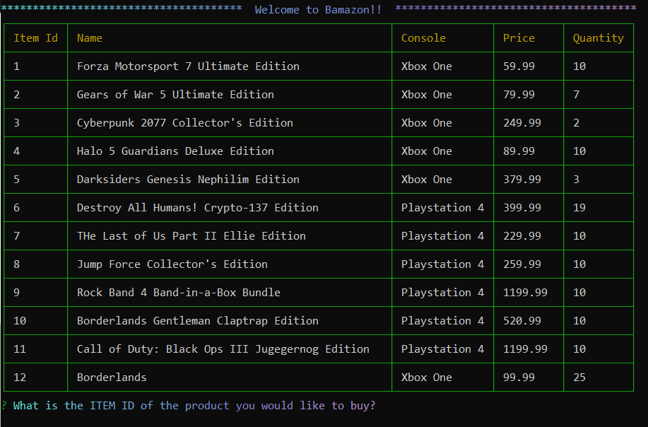
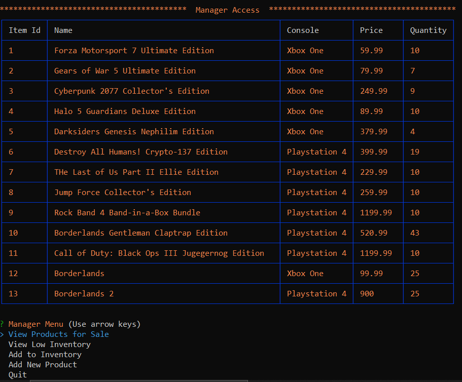

# Welcome to Bamazon
##### Node.js and MySQL assignment
An Amazon-like storefront with Node.js and MySQL. This app will take in orders from customers and deplete stock from the store's inventory. As a bonus task, you can program your app to track product sales across your store's departments and then provide a summary of the highest-grossing departments in the store.

## Technologies Used
    - Node.js
    - MySQL
    - Gradient-string
    - Chalk
    - Cli-table
    - Inquirer
    - ESlint Syntax
### Early versions of the app

### But a good friend of mine convinced me to scale it down

***
***
## bamazonCustomer.js

### IF the customer wants more that whats in stock

### After Purchase

***
***
## bamazonManager.js

### View Products for sale

### View Low Inventory

### Add Inventory

### Add New Product

### Quit

***
***
## bamazonSupervisor

### View Product Sales by Department

### Create New Department

### Quit
